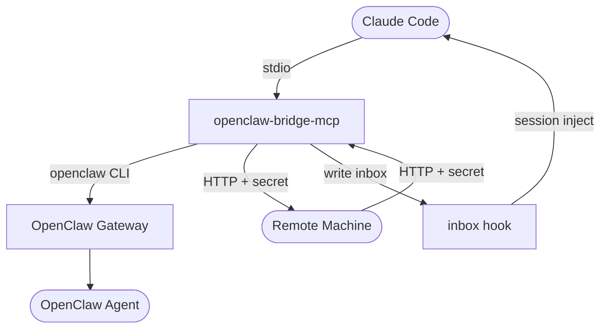

# openclaw-bridge-mcp

[繁體中文](docs/README.zh-TW.md)

Let Claude Code talk directly to [OpenClaw](https://openclaw.ai) agents — no copy-paste, no middleman.

## What Can You Do With This?

**Use Claude Code as a commander, and let OpenClaw agents do the work:**

```
You (in Claude Code): "Summarize today's tech news and post it to Slack"
  → Claude Code sends the task to your OpenClaw agent
  → The agent researches, writes, and posts
  → The result appears right back in your Claude Code session
```

**Coordinate AI agents across multiple machines:**

```
You (in Claude Code): "Ask the server in the office to run the benchmark"
  → Claude Code sends the request to a remote machine over HTTP
  → The remote agent runs it and sends back the results
  → You see the response without leaving your terminal
```

## Why?

Claude Opus is one of the strongest reasoning models, but it's expensive — and using it directly as an autonomous agent's brain may violate Anthropic's [Terms of Service](https://www.anthropic.com/terms). Many [OpenClaw](https://openclaw.ai) users run other models (like ChatGPT) as their agent's brain instead.

Without this bridge, you're the middleman — copy-pasting between Claude Code and OpenClaw's UI (Telegram, web, etc.). With multiple machines, it's even worse.

**Before:** You copy from Claude Code → paste into OpenClaw → wait → copy the result → paste back.

**After:** Claude Code sends tasks and gets results automatically. You stay in your terminal.

### What this project provides

- **Local bridge** — Claude Code calls OpenClaw agents on the same machine via MCP tools
- **Cross-machine messaging** — AI agents send and receive messages across machines via HTTP + shared secret
- **Inbox hook** — Incoming messages appear in your Claude Code session in real time

No infrastructure needed — just `npm install` and go.

## Quick Install

Paste this into Claude Code:

> Install openclaw-bridge-mcp:
> git clone https://github.com/cyyij/openclaw-bridge-mcp.git ~/.openclaw/bridge-mcp,
> run `npm install` in that directory,
> register it with `claude mcp add --scope user openclaw-bridge -- node ~/.openclaw/bridge-mcp/index.js`,
> and add a UserPromptSubmit hook in ~/.claude/hooks.json that runs `~/.openclaw/bridge-mcp/hooks/check-inbox.sh`.

Or follow the [manual installation](#manual-installation) below.

## Architecture



**One MCP server, two modes:**

- **Local mode** (always active) — Claude Code calls `send_to_openclaw` or `send_to_agent` to reach any OpenClaw agent via the gateway. Health-checks the gateway before sending (fail fast).

- **Cross-machine mode** (activates when configured) — Send and receive messages to/from AI agents on other machines via HTTP. Each machine runs a built-in HTTP server alongside the MCP tools. Uses shared secret authentication. Works over Tailscale, LAN, or any network where machines can reach each other.

**Inbox hook** — A shell script that runs on each Claude Code prompt submission, displaying any pending messages from OpenClaw agents.

## Prerequisites

- [OpenClaw](https://openclaw.ai) installed with at least one agent configured
- [Claude Code](https://code.claude.com/docs) installed
- Node.js 18+
- For cross-machine: network connectivity between machines (e.g. Tailscale)

## Manual Installation

```bash
git clone https://github.com/cyyij/openclaw-bridge-mcp.git ~/.openclaw/bridge-mcp
cd ~/.openclaw/bridge-mcp
npm install
```

### 1. Register the MCP Server

```bash
claude mcp add --scope user openclaw-bridge -- node ~/.openclaw/bridge-mcp/index.js
```

This gives you `send_to_openclaw` and `send_to_agent` immediately.

### 2. Cross-Machine Messaging (optional)

Repeat these steps on **every machine** that needs to send or receive messages.

```bash
# Copy and edit the config
cp ~/.openclaw/bridge-mcp/cross-machine/config.example.json ~/.openclaw/bridge-mcp/config.json
# Edit config.json: set localName, and add peers (name → IP)

# Create a shared secret (must be the same on all machines)
mkdir -p ~/.openclaw/bridge
openssl rand -hex 32 > ~/.openclaw/bridge/secret
# Copy this secret to all other machines
```

No need to re-register — the same MCP server automatically detects `config.json` and enables cross-machine tools (`send_message`, `read_inbox`, `health_check`) plus the HTTP listener.

When Claude Code starts, the MCP server automatically:
1. Listens on the configured HTTP port (default: 49168) for incoming messages
2. Provides MCP tools for sending messages and reading the inbox
3. Retries failed sends in the background (exponential backoff, up to 20 attempts)

> **Note:** Machines must be able to reach each other on the configured port. If using Tailscale, no firewall changes needed. For LAN, ensure the port is open.

### 3. Inbox hook

For real-time message injection into active Claude Code sessions, add to `~/.claude/hooks.json`:

```json
{
  "hooks": {
    "UserPromptSubmit": [{
      "type": "command",
      "command": "~/.openclaw/bridge-mcp/hooks/check-inbox.sh"
    }]
  }
}
```

## Configuration

### Local (OpenClaw)

All configuration is via environment variables.

| Variable | Default | Description |
|----------|---------|-------------|
| `OPENCLAW_GATEWAY_PORT` | `18789` | OpenClaw gateway port |
| `OPENCLAW_BRIDGE_DIR` | `~/.openclaw/bridge` | Directory for logs and inbox |

### Cross-machine

Configuration via `config.json` (in project root) and environment variables.

| Variable | Default | Description |
|----------|---------|-------------|
| `CROSS_MACHINE_CONFIG` | `./config.json` | Path to config file |
| `CROSS_MACHINE_SECRET_PATH` | `~/.openclaw/bridge/secret` | Path to shared secret file |
| `CROSS_MACHINE_INBOX_DIR` | `~/.openclaw/bridge` | Directory for inbox file |

`config.json` fields:

| Field | Description |
|-------|-------------|
| `localName` | This machine's display name |
| `port` | HTTP port for sending and receiving messages (default: 49168) |
| `peers` | Map of peer names to IP addresses |

## Usage

### Local — Claude Code → OpenClaw

| Tool | Description |
|------|-------------|
| `send_to_openclaw` | Send a message to the main OpenClaw agent |
| `send_to_agent` | Send a message to a specific OpenClaw agent by ID |

Both accept optional `conversation_id` and `reply_to` for multi-turn tracking.

### Cross-Machine

| Tool | Description |
|------|-------------|
| `send_message` | Send a message to a remote machine |
| `read_inbox` | Read pending messages from the local inbox |
| `health_check` | Check health of remote peers |

These tools only appear when cross-machine is configured.

## Protocol

All local OpenClaw messages use the **bridge-v1** JSON envelope format. See [docs/protocol.md](docs/protocol.md) for the full specification.

## Contributing

See [CONTRIBUTING.md](CONTRIBUTING.md) for guidelines.

## Changelog

See [CHANGELOG.md](CHANGELOG.md) for version history.

## License

MIT
