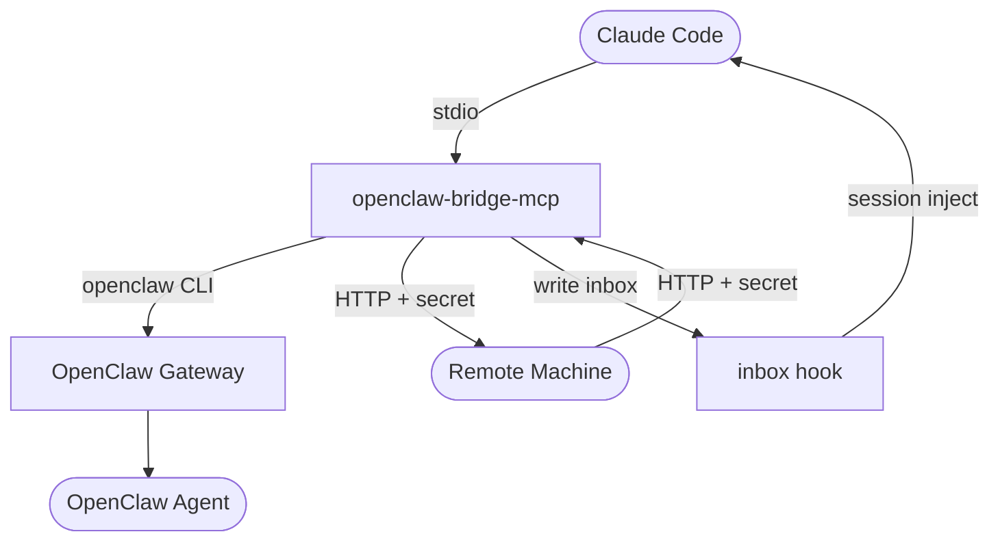

# openclaw-bridge-mcp

[English](../README.md)

讓 Claude Code 直接跟 [OpenClaw](https://openclaw.ai) agent 對話 — 不用複製貼上、不用當傳聲筒。

## 裝了可以幹嘛？

**讓 Claude Code 當指揮官，OpenClaw agent 負責執行：**

```
你（在 Claude Code 裡）：「幫我整理今天的科技新聞，整理完發到 Slack」
  → Claude Code 把任務交給 OpenClaw agent
  → Agent 去搜集、撰寫、發佈
  → 結果自動回到你的 Claude Code session
```

**讓不同機器上的 AI agent 互相協作：**

```
你（在 Claude Code 裡）：「叫辦公室那台 server 跑一下 benchmark」
  → Claude Code 透過 HTTP 把請求送到遠端機器
  → 遠端 agent 執行完畢後回傳結果
  → 你不用離開終端機就能看到回覆
```

## 為什麼需要這個？

Claude Opus 推理能力強，但很貴 — 而且直接拿它當自主 agent 的大腦可能違反 Anthropic 的[服務條款](https://www.anthropic.com/terms)。所以很多 [OpenClaw](https://openclaw.ai) 用戶會改用 ChatGPT 等其他模型當 agent 的大腦。

沒有這個 bridge，你就是傳聲筒 — 在 Claude Code 和 OpenClaw 的 UI（Telegram、網頁等）之間來回複製貼上。多台機器的話更痛苦。

**裝之前：** 你從 Claude Code 複製 → 貼到 OpenClaw → 等結果 → 複製回來 → 貼回 Claude Code。

**裝之後：** Claude Code 自動派任務、自動收結果。你只管下指令。

### 這個專案提供什麼

- **同機橋接** — Claude Code 透過 MCP tools 呼叫同機器上的 OpenClaw agent
- **跨機器通訊** — AI agent 透過 HTTP + shared secret 跨機器收發訊息
- **inbox hook** — 收到的訊息即時顯示在你的 Claude Code session 裡

不需要架 server、不需要 WebSocket，`npm install` 就搞定。

## 快速安裝

把這段話貼進 Claude Code：

> 幫我安裝 openclaw-bridge-mcp：
> git clone https://github.com/cyyij/openclaw-bridge-mcp.git ~/.openclaw/bridge-mcp，
> 在目錄裡執行 `npm install`，
> 用 `claude mcp add --scope user openclaw-bridge -- node ~/.openclaw/bridge-mcp/index.js` 註冊，
> 並在 ~/.claude/hooks.json 加一個 UserPromptSubmit hook 執行 `~/.openclaw/bridge-mcp/hooks/check-inbox.sh`。

或依照下方[手動安裝](#手動安裝)步驟操作。

## 架構



**一個 MCP server，兩種模式：**

- **同機模式**（永遠啟用）— Claude Code 透過 `send_to_openclaw` 或 `send_to_agent` 呼叫 OpenClaw agent。發送前會先檢查 gateway 是否存活（fail fast）。

- **跨機器模式**（有設定才啟用）— 透過 HTTP 收發訊息給其他機器上的 AI agent。每台機器都會自動啟動內建 HTTP server 和 MCP tools。使用 shared secret 驗證。適用於 Tailscale、區網或任何可互通的網路環境。

**inbox hook** — 每次 Claude Code 提交 prompt 時執行的 shell script，顯示來自 OpenClaw agent 的待讀訊息。

## 前置需求

- 已安裝 [OpenClaw](https://openclaw.ai) 並設定至少一個 agent
- 已安裝 [Claude Code](https://code.claude.com/docs)
- Node.js 18+
- 跨機器通訊：機器間需要網路可達（例如 Tailscale）

## 手動安裝

```bash
git clone https://github.com/cyyij/openclaw-bridge-mcp.git ~/.openclaw/bridge-mcp
cd ~/.openclaw/bridge-mcp
npm install
```

### 1. 註冊 MCP Server

```bash
claude mcp add --scope user openclaw-bridge -- node ~/.openclaw/bridge-mcp/index.js
```

註冊完即可使用 `send_to_openclaw` 和 `send_to_agent`。

### 2. 跨機器通訊（選用）

在**每台需要收發訊息的機器**上重複以下步驟。

```bash
# 複製並編輯設定檔
cp ~/.openclaw/bridge-mcp/cross-machine/config.example.json ~/.openclaw/bridge-mcp/config.json
# 編輯 config.json：設定 localName，並加入 peers（名稱 → IP）

# 建立 shared secret（所有機器必須相同）
mkdir -p ~/.openclaw/bridge
openssl rand -hex 32 > ~/.openclaw/bridge/secret
# 把這個 secret 複製到其他所有機器
```

不需要重新註冊 — 同一個 MCP server 偵測到 `config.json` 就會自動啟用跨機器工具（`send_message`、`read_inbox`、`health_check`）和 HTTP listener。

Claude Code 啟動時，MCP server 會自動：
1. 在設定的 HTTP port（預設：49168）監聽來自其他機器的訊息
2. 提供 MCP tools 供發送訊息和讀取收件匣
3. 背景重試失敗的送出（指數退避，最多 20 次）

> **注意：** 機器之間必須能在設定的 port 互通。使用 Tailscale 的話不需要額外設定防火牆。區網環境請確保 port 有開放。

### 3. Inbox hook

若要在 Claude Code session 中即時收到訊息，將以下內容加入 `~/.claude/hooks.json`：

```json
{
  "hooks": {
    "UserPromptSubmit": [{
      "type": "command",
      "command": "~/.openclaw/bridge-mcp/hooks/check-inbox.sh"
    }]
  }
}
```

## 設定

### 同機（OpenClaw）

透過環境變數設定。

| 變數 | 預設值 | 說明 |
|------|--------|------|
| `OPENCLAW_GATEWAY_PORT` | `18789` | OpenClaw gateway 連接埠 |
| `OPENCLAW_BRIDGE_DIR` | `~/.openclaw/bridge` | 日誌與 inbox 目錄 |

### 跨機器

透過 `config.json`（專案根目錄）和環境變數設定。

| 變數 | 預設值 | 說明 |
|------|--------|------|
| `CROSS_MACHINE_CONFIG` | `./config.json` | 設定檔路徑 |
| `CROSS_MACHINE_SECRET_PATH` | `~/.openclaw/bridge/secret` | shared secret 檔案路徑 |
| `CROSS_MACHINE_INBOX_DIR` | `~/.openclaw/bridge` | inbox 目錄 |

`config.json` 欄位：

| 欄位 | 說明 |
|------|------|
| `localName` | 本機顯示名稱 |
| `port` | 收發訊息的 HTTP 連接埠（預設：49168） |
| `peers` | 節點名稱對應 IP 的映射表 |

## 使用方式

### 同機 — Claude Code → OpenClaw

| 工具 | 說明 |
|------|------|
| `send_to_openclaw` | 發送訊息給 OpenClaw 主 agent |
| `send_to_agent` | 發送訊息給指定 ID 的 OpenClaw agent |

兩者都支援 `conversation_id` 和 `reply_to` 進行多輪對話追蹤。

### 跨機器

| 工具 | 說明 |
|------|------|
| `send_message` | 發送訊息到遠端機器 |
| `read_inbox` | 讀取本機收件匣的待處理訊息 |
| `health_check` | 檢查遠端節點健康狀態 |

這些工具只在跨機器模式設定完成後才會出現。

## 協定

同機 OpenClaw 訊息使用 **bridge-v1** JSON 封裝格式。詳見 [docs/protocol.md](protocol.md)。

## 貢獻

請參閱 [CONTRIBUTING.md](../CONTRIBUTING.md)。

## 更新日誌

請參閱 [CHANGELOG.md](../CHANGELOG.md)。

## 授權

MIT
